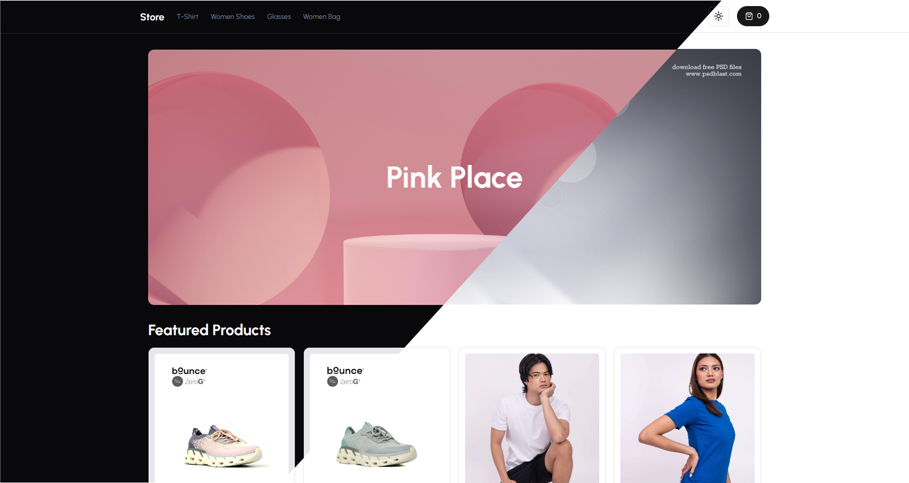

<a name="readme-top"></a>

<!-- PROJECT LOGO -->
<br />
<div align="center">
  <a href="https://github.com/zyx-0314/">
    
  </a>

  <h2 style='margin: 0px; font-weight: 900;' align="center">ECommerce Store Project</h3>
  <h4 style='margin-top: 0px;' align="center">with 5 versions</h4>

</div>
<div align="center">
  <span style='font-weight: 700'>Seamless E-Commerce Solution</span>: Robust template with essential features for smooth browsing, cart management, and secure checkout. Scalable for diverse businesses.
</div>

<br />

---

<br />
<br />

<!-- TABLE OF CONTENTS -->

<details>
  <summary>Table of Contents</summary>
  <ol>
    <li>
      <a href="#about-the-project">About The Project</a>
      <ul>
        <li><a href="#built-with">Built With</a></li>
        <li><a href="#other-components">Other Components</a></li>
      </ul>
    </li>
    <li>
      <a href="#getting-started">Getting Started</a>
      <ul>
        <li><a href="#prerequisites">Prerequisites</a></li>
        <li><a href="#installation">Installation</a></li>
      </ul>
    </li>
    <li><a href="#usage">Usage</a></li>
    <li><a href="#versions">Versions</a></li>
    <li><a href="#road-map">Road Map</a></li>
    <li><a href="#problems-&-solutions">Problems & Solutions</a></li>
    <li><a href="#other-commands">Other Commands</a></li>
  </ol>
</details>

<br />
<br />

---

## About The Project
### Revolutionizing E-Commerce with Seamless Functionality

Welcome to our groundbreaking E-Commerce website project that aims to redefine online shopping experiences. Our team has meticulously crafted a user-centric platform with a focus on providing essential functionalities that streamline the entire shopping journey.

<span style='font-weight: 800'>🔑 Key Functionalities: </span>

<details>
  <summary>Effortless Checkout:</summary>
  Our E-Commerce website is designed to ensure a hassle-free checkout process. Customers can easily add products to their cart, review their selections, and securely complete their transactions.
</details>

<details>
  <summary>Intuitive Cart Management:</summary>
 We understand the importance of a user-friendly cart management system. Our platform enables customers to add, edit, or remove items from their cart with ease, promoting a seamless shopping experience.
</details>

<details>
  <summary>Browsing Made Simple: </summary>
Navigating through a plethora of products has never been easier. Our intuitive interface empowers users to explore various categories, filter options, and find their desired products quickly.
</details>

<details>
  <summary>Smart Sorting Options:</summary>
 To enhance user convenience, we've implemented smart sorting features. Customers can sort products based on relevance, price, popularity, and more, making their shopping journey efficient and tailored.
</details>

<details>
  <summary>Smart Sorting Options:</summary>
 To enhance user convenience, we've implemented smart sorting features. Customers can sort products based on relevance, price, popularity, and more, making their shopping journey efficient and tailored.
</details>

<span style='font-weight: 800'>🥅 The Goal: </span>

At the heart of this project lies our goal to create an E-Commerce platform that transcends conventional boundaries. We aspire to offer a website that seamlessly accommodates different businesses without any interruption, serving as a versatile foundation for a multitude of online ventures.

Our vision extends beyond providing a mere shopping platform. We aim to deliver an immersive digital marketplace where customers can effortlessly discover, compare, and purchase products while relishing a smooth and engaging experience. By focusing on the core functionalities, we ensure that users can complete transactions with confidence, knowing their data is secure and their choices are well-informed.

In an ever-evolving digital landscape, our project's essence is adaptability. As businesses diversify and expand, our E-Commerce website stands ready to evolve alongside them, fostering growth and success. This adaptability ensures that our platform serves as a valuable asset to businesses of all scales, from startups to established enterprises.

In conclusion, our E-Commerce website project is more than just a digital storefront; it's a comprehensive solution designed to redefine how customers interact with products and services online. With intuitive functionalities and a scalable framework, we're excited to bring this vision to life and contribute to the future of E-Commerce.

<div align="right">(<a href="#readme-top">back to top</a>)</div>

<br/>

### Built With

Technologies Used.

TechStack
[![ReactJS][ReactJS.com]][ReactJS-url], [![NextJS][NextJS.com]][NextJS-url]
[![TailwindCSS][TailwindCSS.com]][TailwindCSS-url], [![Shadcn][Shadcn]][Shadcn-url]

Database:
[![PlanetScale][PlanetScale.com]][PlanetScale-url], [![MySQL][MySQL.com]][MySQL-url]

Database Management:
[![Prisma][Prisma.com]][Prisma-url]

Autherntication:
[![Clerk][Clerk.com]][Clerk-url]

Payment Method:
[![Stripe][Stripe.com]][Stripe-url]

Deployed:
[![Vercel][Vercel.com]][Vercel-url]

[Stripe.com]: https://img.shields.io/badge/-Stripe-6772E5?logo=stripe&style=for-the-badge&logoColor=white
[Stripe-url]: https://stripe.com/
[PlanetScale.com]: https://img.shields.io/badge/-PlanetScale-gray?logo=planetscale&style=for-the-badge&logoColor=white
[PlanetScale-url]: https://planetscale.com
[MySQL.com]: https://img.shields.io/badge/-MySQL-blue?logo=mysql&style=for-the-badge&logoColor=white
[MySQL-url]: https://www.mysql.com/
[Clerk.com]: https://img.shields.io/badge/-Clerk-darkgray?logo=clerk&style=for-the-badge&logoColor=white
[Clerk-url]: https://clerk.com/
[NextJS.com]: https://img.shields.io/badge/-NextJS-black?logo=next.js&style=for-the-badge&logoColor=white
[NextJS-url]: https://nextjs.org/
[TailwindCSS.com]: https://img.shields.io/badge/-TailwindCSS-38B2AC?logo=tailwind-css&style=for-the-badge&logoColor=white
[TailwindCSS-url]: https://tailwindcss.com/
[Shadcn]: https://img.shields.io/badge/-Shadcn-3b3b3b?logo=shadcn&style=for-the-badge&logoColor=white
[Shadcn-url]: https://shadcn.com/
[ReactJS.com]: https://img.shields.io/badge/-ReactJS-61A9CB?logo=react&style=for-the-badge&logoColor=white
[ReactJS-url]: https://reactjs.org/
[Vercel.com]: https://img.shields.io/badge/-Vercel-000000?logo=vercel&style=for-the-badge&logoColor=white
[Vercel-url]: https://vercel.com/
[Prisma.com]: https://img.shields.io/badge/-Prisma-2D3748?logo=prisma&style=for-the-badge&logoColor=white
[Prisma-url]: https://www.prisma.io/

<div align="right">(<a href="#readme-top">back to top</a>)</div>

---

<br/>

## Getting Started

To begin developing with our E-Commerce website source code, follow these straightforward installation steps. Before you start, ensure you have Node.js and NPM (Node Package Manager) installed on your system.

**System Requirements:**
- Node.js (Download and install from https://nodejs.org/)
- NPM (Comes with Node.js installation)

[![NodeJS][NodeJS.com]][NodeJS-url] [![NPM][NPM.com]][NPM-url]

[NodeJS.com]: https://img.shields.io/badge/-NodeJS-339933?logo=node.js&style=for-the-badge&logoColor=white
[NodeJS-url]: https://nodejs.org/
[NPM.com]: https://img.shields.io/badge/-NPM-CB3837?logo=npm&style=for-the-badge&logoColor=white
[NPM-url]: https://www.npmjs.com/

**Installation Process:**

1. **Clone the Repository:** Start by cloning the main E-Commerce website repository to your local machine using the following command:
   ```
   git clone https://github.com/zyx-0314/sample-ecommerce-store
   ```

2. **Navigate to Project Directory:** Move into the cloned project directory:
   ```
   cd sample-ecommerce-store
   ```

3. **Install Dependencies:** Install the project dependencies using NPM:
   ```
   npm install
   ```

4. **Running the Admin Page:** Before proceeding, you need to run the admin page. The admin page source code can be found at: [https://github.com/zyx-0314/sample-ecommerce-admin](https://github.com/zyx-0314/sample-ecommerce-admin)

   Follow the installation instructions for the admin page, and ensure it's up and running.

5. **Setup Local Environments:**

   - Create a `.env` file in the root directory of the main project.
   - Inside the `.env` file, set the following environment variable:

     ```
     NEXT_PUBLIC_API_URL=<Admin API URL>
     ```

     Replace `<Admin API URL>` with the actual API URL of the admin page. You can find this URL in the admin settings under the API section.

**Running the E-Commerce Website:**

1. With the admin page and local environment set up, you're ready to start the E-Commerce website. Run the following command in the project directory:

   ```
   npm run dev
   ```

2. Your E-Commerce website should now be accessible locally at `http://localhost:3132`.

Congratulations! You've successfully installed the source code for development. You can now explore and enhance the E-Commerce website to meet your requirements. If you encounter any issues, refer to the documentation or seek assistance from our development community.

<br />

<div align="right">(<a href="#readme-top">back to top</a>)</div>

---

## Usage

**Usage Steps: Installing Source Code for Development**

- Clone the main E-Commerce website repository to your local machine.
  - Command: `git clone https://github.com/zyx-0314/sample-ecommerce-store`

- Navigate to the project directory.
  - Command: `cd sample-ecommerce-main`

- Install project dependencies using NPM.
  - Command: `npm install`

- Run the admin page before proceeding.
  - Admin page source code: [https://github.com/zyx-0314/sample-ecommerce-admin](https://github.com/zyx-0314/sample-ecommerce-admin)

- Set up local environments for the main E-Commerce website.
  - Create a `.env` file in the project root directory.
  - Inside the `.env` file, set the following environment variable:
    ```
    NEXT_PUBLIC_API_URL=<Admin API URL>
    ```
    Replace `<Admin API URL>` with the actual API URL of the admin page.

- Start the E-Commerce website locally.
  - Command: `npm run dev`

- Access the E-Commerce website in your browser.
  - Local URL: `http://localhost:3132`

By following these steps, you'll be able to successfully install and run the E-Commerce website source code for development. Remember that proper setup of the admin page and correct configuration of environment variables are crucial for a seamless development experience.

<br />

<div align="right">(<a href="#readme-top">back to top</a>)</div>

---

## Versions

Version List:
- **v.1.0.0** August 21, 2023
  - Initial Release of the E-Commerce Website

**Version 1.0.0 Release Notes**

Description:
- The 1.0.0 release encompasses the core functionalities of the website, ensuring smooth product browsing, cart management, and secure checkout.
- Users can explore various product categories, apply smart sorting options, and effortlessly add items to their cart.

<br />

<div align="right">(<a href="#readme-top">back to top</a>)</div>

---

## Preview

**Mobile Version**
Filter


<br />

**Desktop Version**
Main Landing Page
<div style='display: flex; gap: 5px'>
  
  
</div>

Category Page
<div style='display: flex; gap: 5px'>
  
  
</div>

Modal


Product Page


Filter


Theme


Shopping Cart


Check out Using Stripe [![Stripe][Stripe.com]][Stripe-url]


<br />

<div align="right">(<a href="#readme-top">back to top</a>)</div>

---

## Road Map

<ol>
  <li> Improve the filtering of Items, Adding Multiple Item at once </li>
  <li> Add Carousel at the Landing page for promotional billboards </li>
  <li> Multiple Item order </li>
  <li> Account </li>
  <li> Tracking of Item Status </li>
</ol>

<br />

<div align="right">(<a href="#readme-top">back to top</a>)</div>

---

## Problems & Solutions

Problems encountered and solutions.

<br />

<div align="right">(<a href="#readme-top">back to top</a>)</div>

---

## Other Commands

Other commands that can be used.

<br />

<div align="right">(<a href="#readme-top">back to top</a>)</div>

